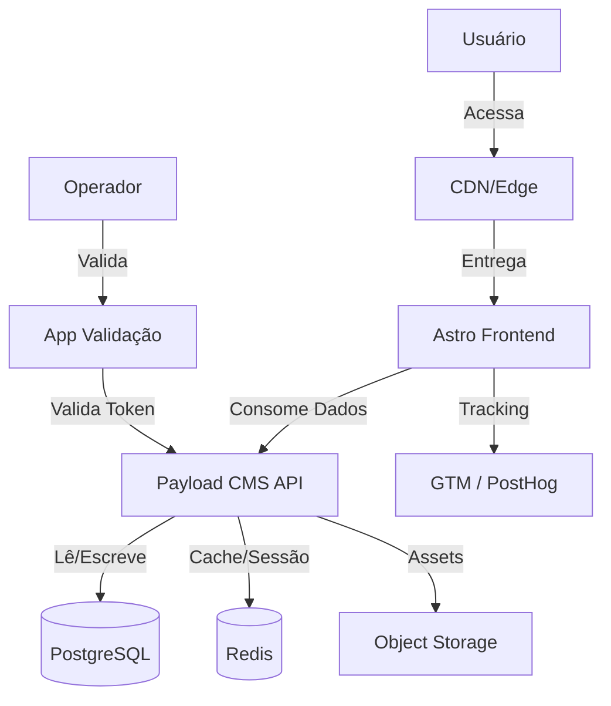

# 03-TECH-SPEC: Especificação Técnica

## 1. Arquitetura do Sistema

A arquitetura segue o padrão **Headless Commerce**, onde o Frontend (Astro) consome dados do Backend (Payload CMS) via API REST/GraphQL.

---

## 2. Stack Tecnológica

| Camada | Tecnologia | Justificativa |
| :--- | :--- | :--- |
| **Frontend** | **Astro** | Performance superior (Island Architecture), SEO nativo, SSG para conteúdo estático. |
| **Estilização** | **TailwindCSS** | Desenvolvimento rápido, design system consistente. |
| **Interatividade** | **Framer Motion** | Animações fluidas e micro-interações premium. |
| **Backend** | **Payload CMS** | Headless, TypeScript-first, customizável, self-hosted. |
| **Banco de Dados** | **PostgreSQL** | Relacional, robusto, suporte a JSONB. |
| **Cache/Fila** | **Redis** | Gestão de sessões, cache de API, controle de concorrência (reservas). |
| **Storage** | **S3-compatible** | Armazenamento de imagens de produtos e mídia. |
| **Monitoramento** | **Sentry** | Rastreamento de erros fullstack. |

---

## 3. Modelo de Dados (Schema Simplificado)

### 3.1. Core
-   **Users**: Admin, Editores, Operadores.
-   **Customers**: Clientes finais (Email, CPF, Histórico).

### 3.2. Ecommerce
-   **Products**: Nome, Slug, Preço, Estoque, Imagens, Categoria.
-   **Categories**: Hierarquia de categorias.
-   **Orders**: Items, Total, Status, CustomerID, PaymentID.

### 3.3. Estância (Reservas)
-   **Events**: Data, Capacidade Total, Slots de Horário.
-   **Tickets**: Vinculado a um Order, possui `qr_code_hash`, `status` (pending, active, used), `valid_date`.
-   **Reservations**: Bloqueio temporário de slot (TTL via Redis).

---

## 4. API & Integrações

### Endpoints Críticos (Payload Custom Endpoints)
-   `POST /api/checkout`: Cria ordem, processa pagamento.
-   `POST /api/tickets/validate`: Recebe hash do QR, retorna status.
-   `GET /api/availability`: Retorna slots disponíveis p/ data.

### Pagamento
-   Gateway: Pagar.me (Exemplo).
-   Webhook: `POST /api/webhooks/payment`: Atualiza status do Order e libera Tickets.

---

## 5. Estratégia de Deploy
-   **Frontend**: Vercel/Netlify (CI/CD automático via Git).
-   **Backend**: Railway/Render/AWS (Docker container).
-   **Banco de Dados**: Managed PostgreSQL (Supabase/Neon/RDS).

---

## 6. Segurança
-   **Autenticação**: Payload Auth (JWT/Cookies).
-   **CORS**: Restrito aos domínios do frontend.
-   **Ratelimit**: Redis-based rate limiting para endpoints sensíveis (checkout, validação).
